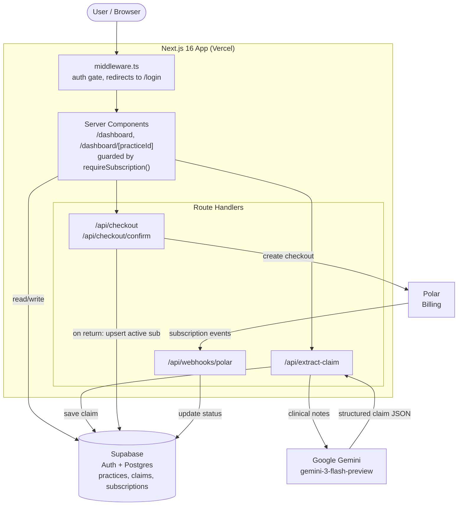

# DentalFlow

**Turn free-text dental clinical notes into structured, billable insurance claims in seconds.**

Live app: https://dentalflow-health.vercel.app/

## What is DentalFlow?

DentalFlow is a SaaS tool for dental practices that converts a provider's free-text clinical notes into a structured insurance claim, complete with [CDT codes](https://www.ada.org/publications/cdt), tooth numbers, procedures, fees, and diagnosis codes. Paste in what happened during the visit, and DentalFlow returns a clean, ready-to-review claim that it also saves to the practice's claim history.

It is multi-practice: one account can manage several practices (each with its own NPI), and every practice keeps its own running history of extracted claims.

## The problem it solves

Dental billing is slow and error-prone. After every appointment, staff manually translate clinical notes into the correct CDT procedure codes, a tedious and specialized task where a wrong or missing code means a denied claim, delayed reimbursement, and rework. Smaller practices often do not have a dedicated biller, so this falls on already-busy clinical staff.

DentalFlow automates the notes-to-codes step with an LLM prompted to act as a dental billing expert, so practices can:

- Save time by skipping manual code lookup and getting a structured claim instantly.
- Reduce denials through consistent, accurate CDT coding from the clinical narrative.
- Stay organized, with claims stored per practice and full history.

## Tech stack

| Layer | Technology |
|---|---|
| Framework | [Next.js 16](https://nextjs.org) (App Router) + [React 19](https://react.dev) |
| Language | TypeScript |
| Styling | Tailwind CSS v4 |
| Auth & Database | [Supabase](https://supabase.com) (email/password auth + Postgres) |
| AI extraction | [Google Gemini](https://ai.google.dev) (`gemini-3-flash-preview`) |
| Billing | [Polar](https://polar.sh) (subscription, $199/month) |
| Hosting | [Vercel](https://vercel.com) |

## Features

- Email/password authentication via Supabase, with session-aware middleware protecting every route.
- Multi-practice management: add, view, and delete practices, each with its own NPI.
- AI claim extraction: paste clinical notes and get back structured JSON covering patient, date of service, provider, tooth numbers, procedures with CDT codes and fees, and diagnosis codes.
- Per-practice claim history, where every extraction is saved and listed under its practice.
- Subscription paywall: Polar-powered checkout at $199/month gates access to the app, with webhooks keeping subscription status in sync.

## Architecture overview

DentalFlow is a Next.js App Router app with two distinct access-control gates and three external services. Middleware enforces **authentication** on every request; protected pages additionally enforce an active **subscription** before rendering.



**How access control works**

1. Authentication: [`middleware.ts`](middleware.ts) refreshes the Supabase session on every non-static request and redirects unauthenticated users to `/login`. A small whitelist (`/login`, `/pricing`, checkout and webhook routes) stays public.
2. Subscription: protected pages call [`requireSubscription()`](src/lib/requireSubscription.ts), which redirects to `/pricing` unless the user has an `active` row in the `subscriptions` table. Middleware checks auth only; the paywall is enforced at the page level.

**Billing lifecycle:** `/api/checkout` creates a Polar checkout and, on return, `/api/checkout/confirm` immediately upserts an active subscription so access is granted without waiting. The `/api/webhooks/polar` handler is the long-term source of truth, updating subscription status on Polar's `subscription.active`, `canceled`, and `revoked` events.

## Getting started

```bash
npm install
npm run dev      # http://localhost:3000
```

Create a `.env.local` with the following (see usage in [`CLAUDE.md`](CLAUDE.md)):

```bash
NEXT_PUBLIC_SUPABASE_URL=
NEXT_PUBLIC_SUPABASE_ANON_KEY=
GEMINI_API_KEY=
POLAR_ENV=sandbox            # or "production"
POLAR_ACCESS_TOKEN=
POLAR_PRODUCT_ID=
POLAR_WEBHOOK_SECRET=
```

Other scripts:

```bash
npm run build    # production build
npm run start    # serve production build
npm run lint     # eslint
```
